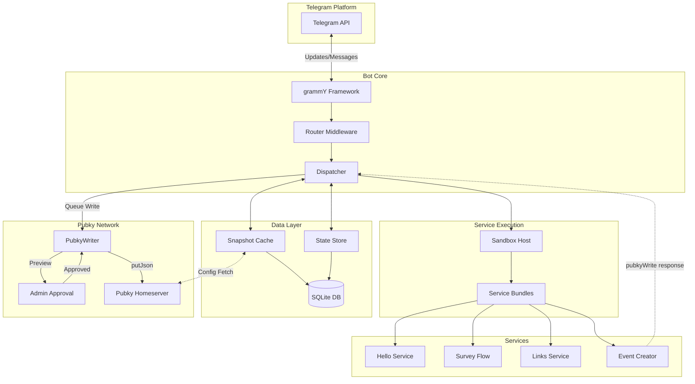
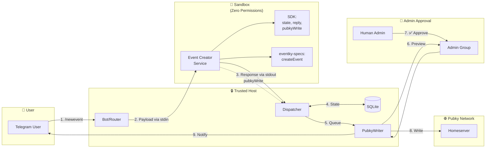
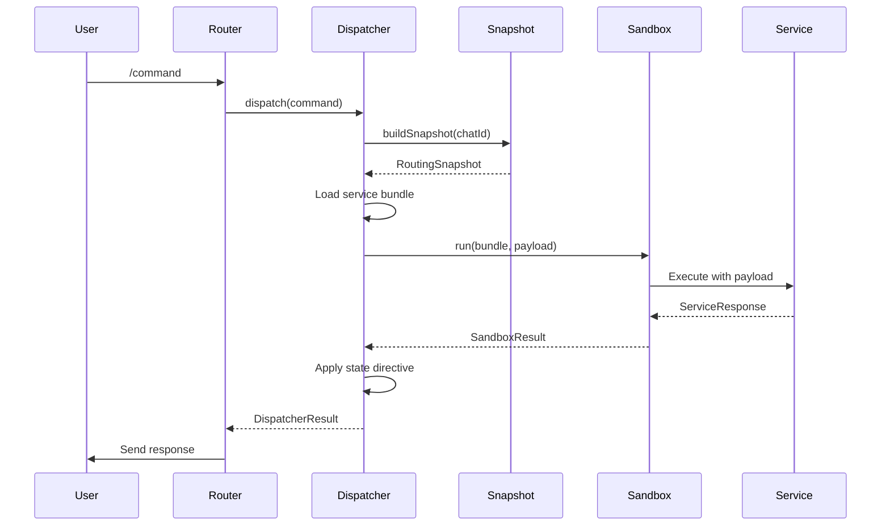
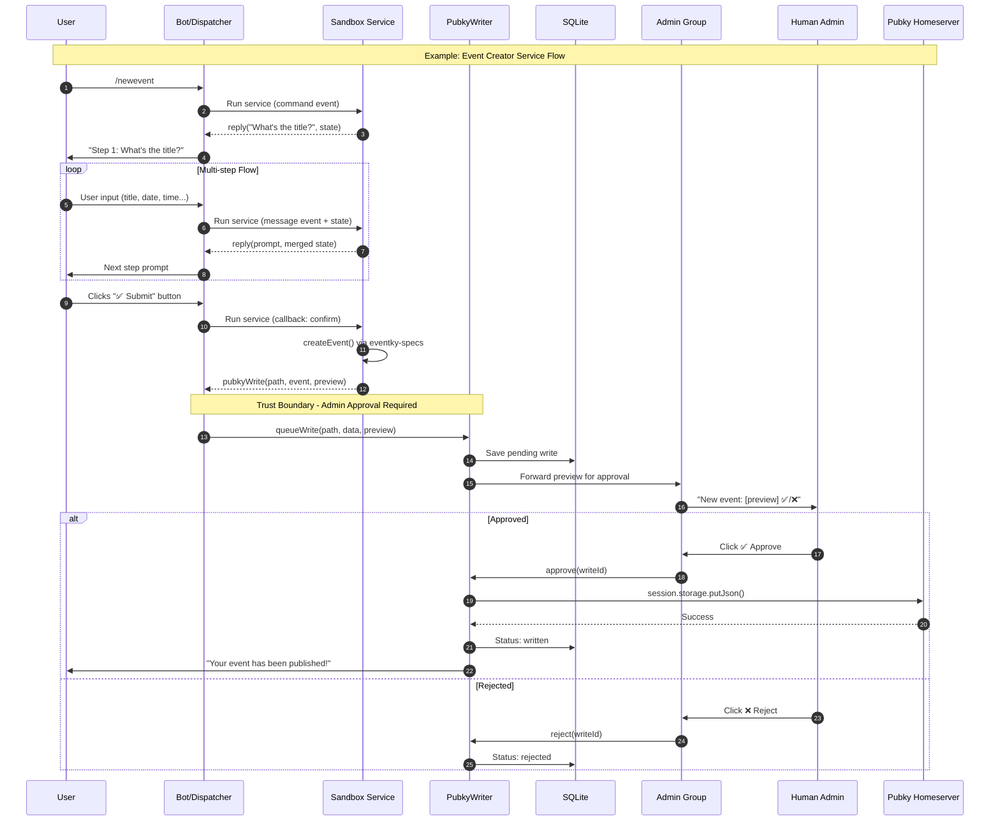
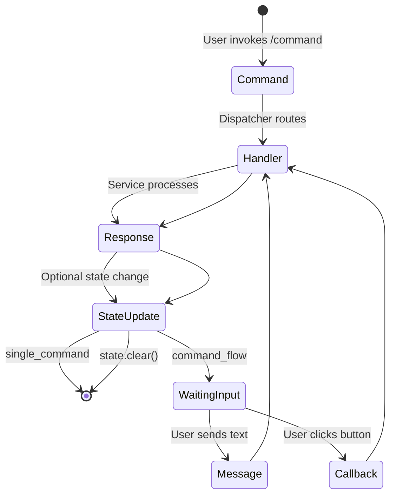
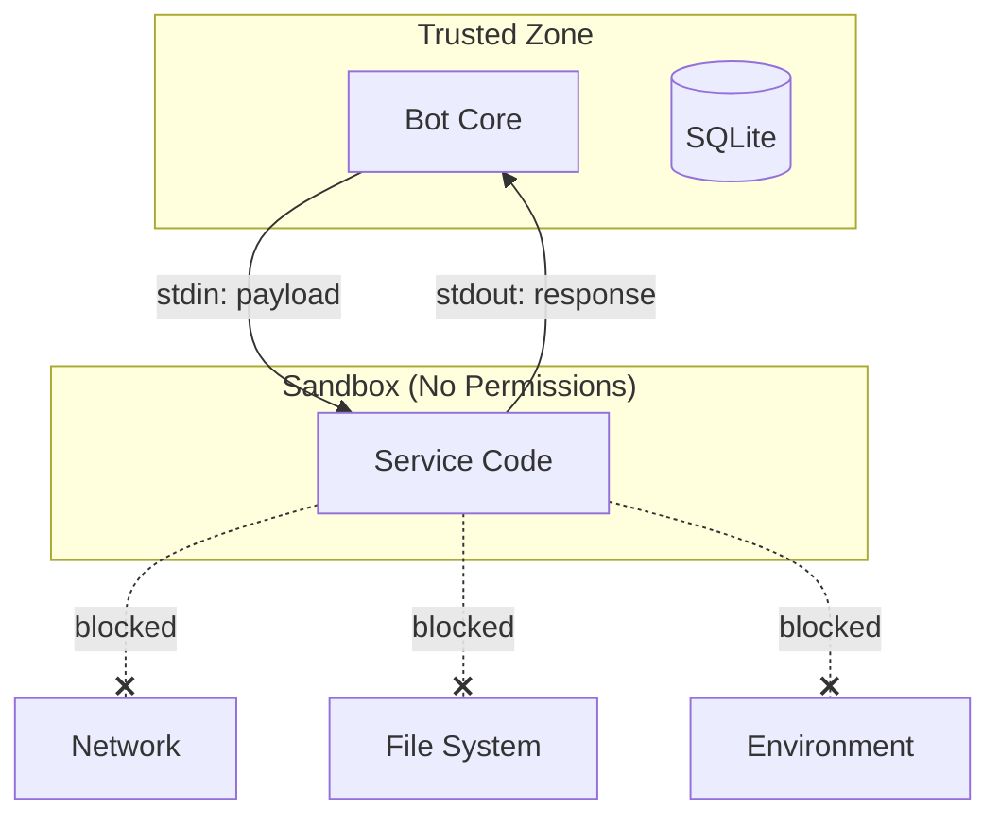

# Pubky Bot Builder - Architecture Overview

This document provides an overview of the Pubky Bot Builder system architecture, how services work,
and how to configure and extend the bot.

## High-Level Architecture



## Complete Flow Example: Event Creator Service

The following diagram shows the complete data flow when a user creates an event using the Event
Creator service, demonstrating how sandboxed services can safely publish to the decentralized Pubky
network:



**Flow Steps:**

1. User sends `/newevent` command
2. Dispatcher runs Event Creator in isolated sandbox
3. Service uses SDK to build multi-step flow, collects event data
4. State persists between steps via SQLite
5. On confirm, service returns `pubkyWrite()` response with event data
6. PubkyWriter queues write and forwards preview to admin group
7. Human admin reviews and approves the event
8. PubkyWriter executes `session.storage.putJson()` to Pubky homeserver
9. User receives confirmation message

## Core Components

### 1. Bot Entry Point (`src/bot.ts`, `src/main.ts`)

The bot initializes with grammY and connects to Telegram. It supports two modes:

- **Polling mode** (development): `deno task dev`
- **Webhook mode** (production): `deno task serve`

### 2. Router Middleware (`src/middleware/router.ts`)

Routes incoming Telegram updates to the appropriate handlers:

- `/start` - Initializes commands for the chat
- `/config` - Admin-only inline menu for per-chat feature overrides (see
  `src/middleware/config_ui/`)
- Service commands - Dispatched to the service sandbox

### 3. Dispatcher (`src/core/dispatch/dispatcher.ts`)

The dispatcher is the heart of the system. It:

1. Receives events (commands, callbacks, messages)
2. Looks up the appropriate service from the routing snapshot
3. Loads the service bundle
4. Executes the service in a sandboxed environment
5. Processes the response and manages state



### 4. Sandbox Host (`src/core/sandbox/host.ts`)

Services run in isolated Deno subprocesses with no permissions by default:

- No network access
- No file system access
- No remote module imports
- Timeout protection (max 20 seconds)

This ensures services cannot access sensitive data or cause harm.

### 5. PubkyWriter (`src/core/pubky/writer.ts`)

The PubkyWriter enables services to publish data to the Pubky decentralized network with admin
approval:



**Key Security Features:**

- Services cannot directly write to Pubky (sandbox isolation)
- All writes require human admin approval
- Preview shown to admins before approval
- Writes are tracked in SQLite with full audit trail
- Timeout-based expiration for pending writes

### 6. Snapshot System (`src/core/snapshot/snapshot.ts`)

Snapshots are cached routing tables that map commands to service bundles:

- Built from configuration templates
- Cached in-memory with TTL
- Persisted to SQLite by config hash
- Includes integrity verification

## Service Types

Services are defined using the SDK and come in three types:

| Kind             | Description                      | Use Case                                    |
| ---------------- | -------------------------------- | ------------------------------------------- |
| `single_command` | Stateless, responds once         | Simple utilities, links, greetings          |
| `command_flow`   | Stateful, multi-step interaction | Surveys, wizards, forms                     |
| `listener`       | Responds to any message          | Auto-responders, bots that react to content |

### Service Lifecycle



## SDK Overview

The SDK (`packages/sdk/`) provides building blocks for services:

### Event Types

```typescript
// Command event - user invoked a bot command
type CommandEvent = { type: "command" } & ServiceContext;

// Callback event - user clicked an inline button
type CallbackEvent = { type: "callback"; data: string } & ServiceContext;

// Message event - user sent a message (text, photo, etc.)
type MessageEvent = { type: "message"; message: unknown } & ServiceContext;
```

### Service Context

Every event includes:

- `chatId` - Telegram chat identifier
- `userId` - Telegram user identifier
- `language` - User's language code
- `state` - Current service state (for flows)
- `serviceConfig` - Custom configuration from bot config
- `datasets` - Loaded dataset objects
- `routeMeta` - Service routing metadata

### Response Types

Services return one of these response types:

| Response               | Purpose                       |
| ---------------------- | ----------------------------- |
| `reply(text)`          | Send a new message            |
| `edit(text)`           | Edit the triggering message   |
| `photo(url)`           | Send a photo                  |
| `audio(url)`           | Send audio                    |
| `video(url)`           | Send video                    |
| `document(url)`        | Send a document               |
| `location(lat, lng)`   | Send a location               |
| `contact(phone, name)` | Send a contact                |
| `del()`                | Delete the triggering message |
| `none()`               | No response                   |
| `error(text)`          | Error response                |
| `uiKeyboard(kb)`       | UI keyboard response          |
| `uiMenu(menu)`         | UI menu response              |
| `uiCard(card)`         | UI card response              |
| `uiCarousel(items)`    | UI carousel response          |

### State Management

For `command_flow` services, state persists between interactions:

```typescript
import { state } from "@sdk/mod.ts";

// Replace entire state
state.replace({ step: 1, data: "value" });

// Merge with existing state
state.merge({ step: 2 });

// Clear state (ends flow)
state.clear();
```

### UI Builder

Cross-platform UI abstraction:

```typescript
import { UIBuilder } from "@sdk/mod.ts";

// Keyboard with callback buttons
const keyboard = UIBuilder.keyboard()
	.namespace("my_service") // Auto-prefix callbacks
	.callback("Option 1", "opt1")
	.row()
	.callback("Option 2", "opt2")
	.build();

// Menu grid
const menu = UIBuilder.menu("Select an option")
	.callback("A", "a")
	.callback("B", "b")
	.columns(2)
	.build();

// Card with image and actions
const card = UIBuilder.card("Title")
	.description("Description text")
	.image("https://example.com/image.jpg")
	.callback("Action", "action_data")
	.build();
```

## Creating a Service

### Minimal Example (single_command)

```typescript
// my_service/service.ts
import { defineService, none, reply, runService } from "@sdk/mod.ts";
import type { CommandEvent } from "@sdk/mod.ts";

const service = defineService({
	id: "my_service",
	version: "1.0.0",
	kind: "single_command",
	command: "mycommand",
	description: "Does something useful",
	handlers: {
		command: (ev: CommandEvent) => {
			return reply("Hello from my service!");
		},
		callback: () => none(),
		message: () => none(),
	},
});

export default service;
if (import.meta.main) await runService(service);
```

### Stateful Flow Example (command_flow)

```typescript
// wizard/service.ts
import { defineService, none, reply, runService, state } from "@sdk/mod.ts";
import type { CallbackEvent, CommandEvent, MessageEvent } from "@sdk/mod.ts";

interface WizardState {
	step: number;
	name?: string;
}

const service = defineService({
	id: "wizard",
	version: "1.0.0",
	kind: "command_flow",
	command: "wizard",
	handlers: {
		command: (ev: CommandEvent) => {
			return reply("What is your name?", {
				state: state.replace({ step: 1 }),
			});
		},
		message: (ev: MessageEvent) => {
			const st = ev.state as WizardState;
			if (st?.step === 1) {
				const name = (ev.message as { text?: string })?.text;
				return reply(`Nice to meet you, ${name}!`, {
					state: state.clear(), // End the flow
				});
			}
			return none();
		},
		callback: () => none(),
	},
});

export default service;
if (import.meta.main) await runService(service);
```

## Configuration

### Feature configuration

A feature in `config.yaml` references a service from `src/services/registry.ts` and supplies its
config blob:

```yaml
features:
  hello:
    service: simple_response
    groups: false
    dms: true
    config:
      message: "Hey there 👋"

  signup:
    service: signup_flow # example: a hypothetical command_flow service
    groups: true
    dms: true
    config:
      custom_option: true
```

### Feature fields

See [configuration.md](configuration.md#feature-fields) for the full reference.

### Datasets

Datasets are inline payloads attached to a feature — large or structured data that services consume
via `ev.datasets.<name>`:

```yaml
features:
  shitcoin_alarm:
    service: triggerwords
    config: { responseProbability: 1 }
    datasets:
      triggers:
        version: "1.0.0"
        entries:
          - matchMode: word
            triggers: [solana, cardano]
            responses: ["Not in this chat."]
```

In the service, access via `ev.datasets.triggers`.

### Environment Variables

| Variable              | Default         | Description                           |
| --------------------- | --------------- | ------------------------------------- |
| `BOT_TOKEN`           | _required_      | Telegram bot token                    |
| `NODE_ENV`            | `development`   | Environment mode                      |
| `DEBUG`               | `0`             | Enable debug mode                     |
| `LOG_MIN_LEVEL`       | `info`          | Logging level (debug/info/warn/error) |
| `LOG_PRETTY`          | `0`             | Pretty-print logs                     |
| `CONFIG_FILE`         | `./config.yaml` | Path to the operator config file      |
| `WEBHOOK`             | `0`             | Enable webhook mode                   |
| `DEFAULT_MESSAGE_TTL` | `0`             | Auto-delete messages after N seconds  |

See `CLAUDE.md` for the full list of config-file override env vars (`BOT_ADMIN_IDS`,
`LOCK_DM_CONFIG`, `PUBKY_*`, etc).

## Pubky Integration

Bot configuration is NOT loaded from Pubky — it's a local `config.yaml`. Pubky is used for two much
narrower things:

1. **Publishing events** (e.g. `event_creator` service) via `pubkyWriter`, which queues writes for
   admin approval in the configured admin group before pushing them to the operator's homeserver.
2. **Fetching calendar metadata** when a chat admin adds an external `pubky://` calendar URI under
   `/config → Calendars`.

Both paths are only active when `pubky.enabled: true` in `config.yaml` and a recovery keypair is
configured.

### Pubky URLs

- Format: `pubky://<public_key>/pub/<app>/<resource>/<id>`
- Used for: event writes, calendar metadata, and file/blob uploads attached to events

## Security Model



Services run in complete isolation:

- No network access (`--no-remote`)
- No environment variables
- No file system access
- Communication only via stdin/stdout JSON
- Timeout enforcement

## File Structure

See `CLAUDE.md` for the authoritative tree — it's kept in sync with the codebase. The short version:

```
loombot/
├── config.yaml             # Operator-owned configuration (copied from configs/*.example.yaml)
├── configs/                # Example YAML profiles
├── src/
│   ├── bot.ts              # Bot initialization
│   ├── main.ts             # Entry point (polling or webhook)
│   ├── core/
│   │   ├── config/         # Loader, schema, merge, runtime, store, migrations
│   │   ├── dispatch/       # Event dispatcher
│   │   ├── sandbox/        # Service subprocess sandbox
│   │   ├── snapshot/       # Routing snapshots + cache
│   │   ├── scheduler/      # Periodic meetups broadcaster
│   │   ├── state/          # Per-user flow state
│   │   └── pubky/          # Writer + calendar metadata helpers
│   ├── middleware/
│   │   ├── router.ts       # Command routing
│   │   ├── admin.ts        # Admin checks
│   │   ├── response.ts     # Response handling
│   │   └── config_ui/      # /config inline menu
│   ├── services/           # Operator-shipped service registry
│   └── adapters/
│       └── telegram/       # Telegram-specific adapters
├── packages/
│   ├── sdk/                # Service SDK (inlined into every service bundle)
│   ├── core_services/      # Operator-shipped services
│   └── eventky-specs/      # Local eventky data utilities
└── docs/
```

## Next Steps

- See [services.md](services.md) for the service development guide
- See [configuration.md](configuration.md) for the full config reference
- See `packages/core_services/` for working service examples
